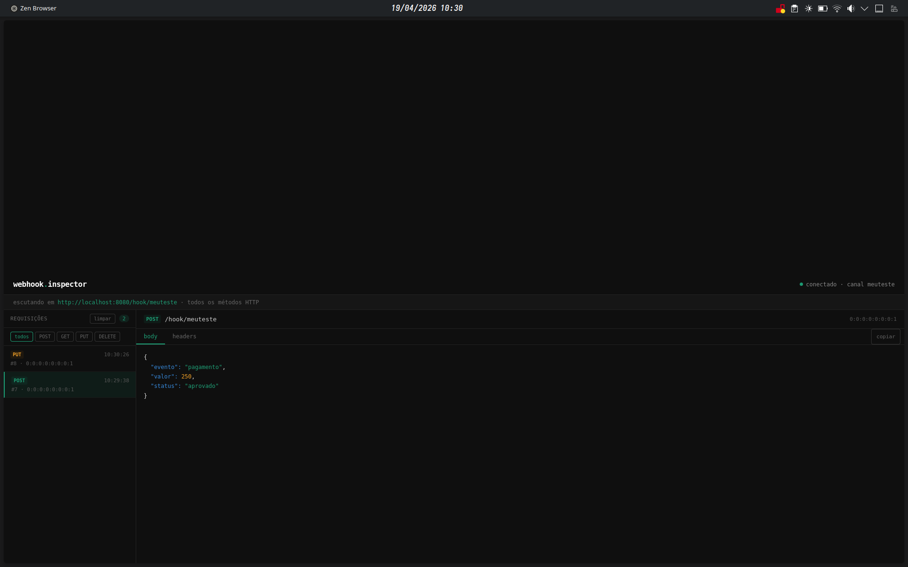

# webhook.inspector

Ferramenta para inspecionar e debugar webhooks em tempo real, construída com Java e Spring Boot.

Funciona como uma versão própria do [webhook.site](https://webhook.site) — você cria um canal, aponta qualquer serviço externo para a URL gerada e visualiza as requisições no painel instantaneamente.



## Funcionalidades

- Recebe requisições HTTP de qualquer método (GET, POST, PUT, DELETE)
- Painel atualizado em tempo real via WebSocket
- Visualização de headers e body com syntax highlighting
- Filtro por método HTTP
- Suporte a múltiplos canais simultâneos
- Histórico persistido e limpeza com um clique
- Copia body/headers para o clipboard

## Tecnologias

- Java 25
- Spring Boot 3.5
- Spring WebSocket + STOMP
- Spring Data JPA
- H2 Database
- HTML, CSS e JavaScript puro

## Como rodar

**Pré-requisitos:** Java 17+ e Maven instalados.

```bash
# Clone o repositório
git clone https://github.com/seuusuario/webhook-inspector.git
cd webhook-inspector

# Rode o projeto
mvn spring-boot:run
```

Acesse `http://localhost:8080`, digite um nome de canal e comece a receber webhooks.

## Testando

Com o servidor rodando, envie uma requisição de teste:

```bash
curl -X POST http://localhost:8080/hook/meucanal \
  -H "Content-Type: application/json" \
  -d '{"evento": "pagamento", "valor": 150}'
```

A requisição aparece instantaneamente no painel.

## Estrutura do projeto

```
src/main/java/com/vini/webhook_inspector/
├── controller/      # Rotas HTTP
├── service/         # Lógica de negócio
├── repository/      # Acesso ao banco
├── model/           # Entidades
└── config/          # Configuração do WebSocket

src/main/resources/static/
├── index.html       # Estrutura do painel
├── style.css        # Estilos
└── app.js           # Lógica do frontend
```